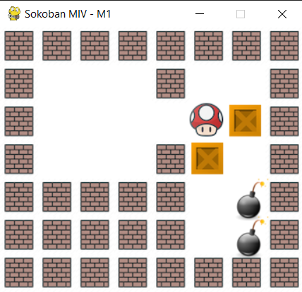
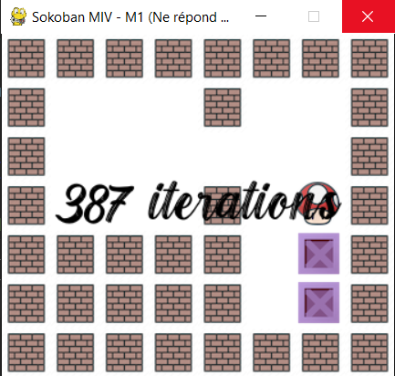

# SOKOPUZZLE

This project is a simulation of the Sokoban puzzle game.

## How it works:
- Provide a desired game board.
- It returns a graphical simulation of the path to follow in order to win the game.

The search for the winning path is carried out using two algorithms:
- **Breadth-First Search (BFS)**: `breadthFirst()` (with and without deadlocks).
- **A star Algorithm**: (with and without deadlocks) and with different heuristics.

## Interface:
- The graphical interface is built using **Pygame**.

## How to run:
- Open the file `sokoPuzzleGraphics.py` and execute it.

## Example:
 

 
       
